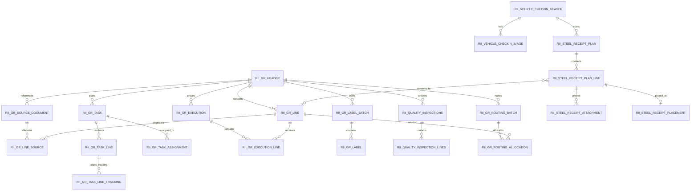
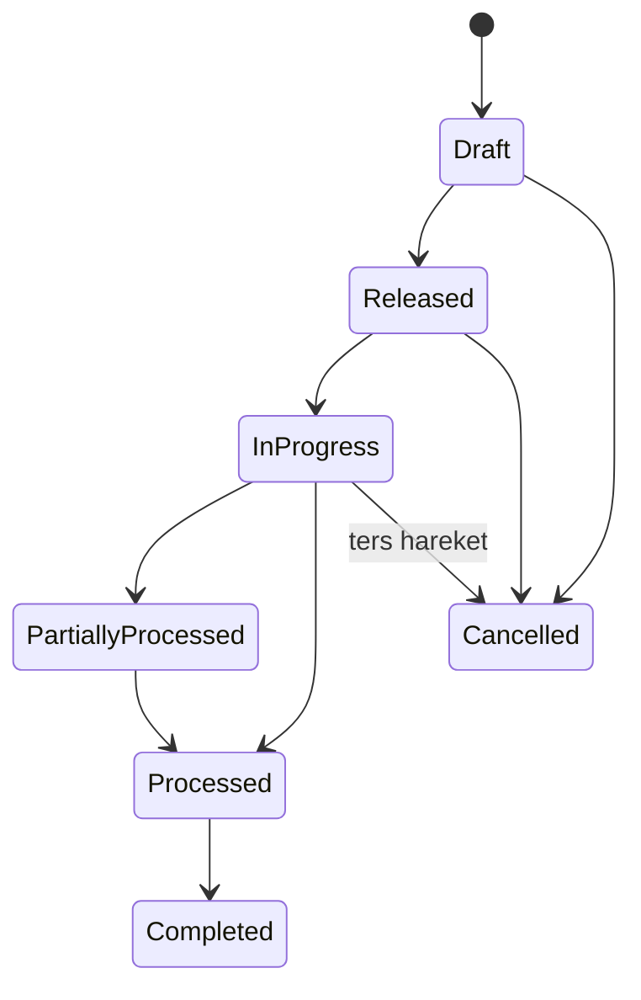
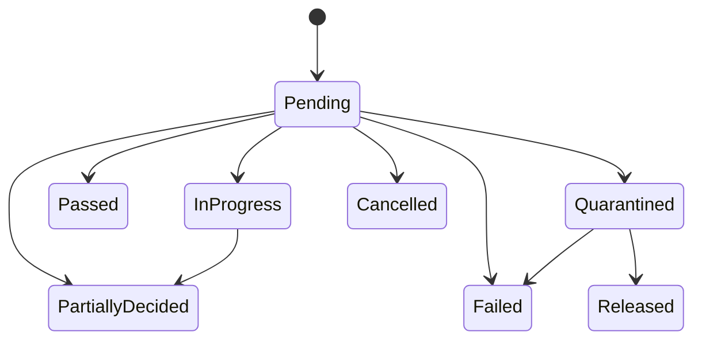
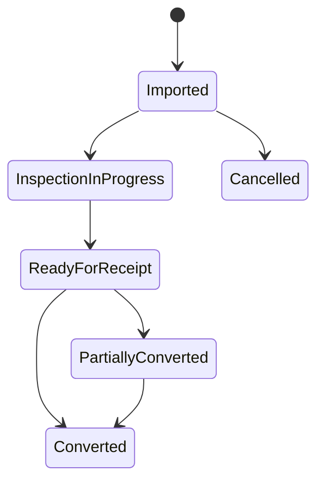
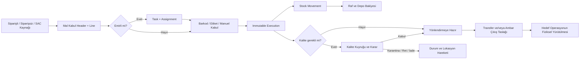

# WMS V2 Mal Kabul, Kalite ve SAC Süreçleri

## Developer Uygulama ve İş Akışı Rehberi

| Bilgi | Değer |
|---|---|
| Proje | VERII WMS V2 |
| API | `verii_wms_api_v2` |
| Web | `verii_wms_web_v2` |
| Veritabanı | `V3RIIWMSV2` |
| Kapsam | Mal kabul, emir/atama, fiziksel kabul, kalite, mal kabul sonrası dağıtım, SAC araç girişi ve saha yerleştirme |
| Doküman durumu | Mevcut kodun çalışma biçimini açıklayan geliştirici kaynağı |
| Son doğrulama | 25.07.2026 |

> Bu doküman yalnızca ekran tasarımını açıklamaz. Tablo sorumluluklarını, işlem sırasını, durum geçişlerini, miktar kurallarını, yetkileri, API sözleşmelerini, transaction sınırlarını ve test senaryolarını birlikte tanımlar.

---

## 1. Temel mimari kararlar

### 1.1. Modül sınırları

- `GoodsReceipt`: Mal kabul belgesi, satırlar, kaynak siparişler, emirler, atamalar, fiziksel kabul, etiketler ve kabul sonrası yönlendirme.
- `Quality`: Kalite parametreleri, stok/stok grubu kuralları, kalite inceleme kuyruğu ve kalite kararları.
- `VehicleCheckIn`: SAC mal kabulünden önce araç, sürücü, levha adedi ve araç görselleri.
- `SteelReceipt`: Beklenen SAC listesinin içe alınması, saha kontrolü, ortak mal kabul emrine dönüştürme ve nihai saha/raf yerleştirme.
- `WarehouseTransfer`: Mal kabulden depolar arası transfer taslağı oluşturulan hedef modül.
- `WarehouseOutbound`: Mal kabulden ambar çıkış taslağı oluşturulan hedef modül.
- `StockMovement`: Fiziksel stok değişiminin değiştirilemez hareket defteri.
- `StockBalance`: Raf ve depo bakiyelerinin hareket defterinden üretilen projection tabloları.
- `Audit`: Kim, ne zaman, hangi kaydı, hangi işlemle değiştirdi bilgisinin merkezi kaydı.

### 1.2. Değişmez kurallar

1. Bakiye doğrudan artırılmaz veya azaltılmaz. Bütün fiziksel değişiklikler `StockMovement` üzerinden yapılır.
2. Fiziksel kabul kanıtı olan execution kayıtları geriye dönük düzenlenmez. Hata, ters hareket veya iptal akışıyla düzeltilir.
3. Aynı istemci komutunun tekrar gönderilmesi yeni belge/hareket üretmemelidir. Bu nedenle işlem komutları `IdempotencyKey` taşır.
4. Eş zamanlı işlemlerde `RowVersion` ile optimistic concurrency uygulanır.
5. Miktar ayırma ve otomatik istif sırası gibi yarışa açık işlemler `Serializable` transaction içinde yürütülür.
6. `DateOnly` alanları iş tarihidir; zaman dilimine çevrilmez.
7. Operasyon zamanları UTC tutulur. Web, proje saat dilimine göre gösterir.
8. Tablolar soft-delete kullanır. Normal sorgular `IsDeleted = false` global filtresinden geçer.
9. Snapshot alanları, ERP master verisi sonradan değişse bile belgenin oluşturulduğu andaki kod/ad bilgisini korur.
10. Kullanıcının kimliği request body’den alınmaz; JWT içindeki kullanıcı kimliğinden bulunur.

---

## 2. Ortak tablo alanları

Operasyon tablolarının tamamı `BaseEntity` üzerinden aşağıdaki alanları alır:

| Alan | Tip | Açıklama |
|---|---|---|
| `Id` | `bigint` | Primary key |
| `BranchCode` | `nvarchar` | Şube izolasyonu |
| `CreatedDate` | `datetime2` | UTC oluşturulma zamanı |
| `CreatedBy` | `bigint?` | Kaydı oluşturan kullanıcı |
| `UpdatedDate` | `datetime2?` | UTC son güncelleme zamanı |
| `UpdatedBy` | `bigint?` | Son güncelleyen kullanıcı |
| `DeletedDate` | `datetime2?` | Soft-delete zamanı |
| `DeletedBy` | `bigint?` | Soft-delete yapan kullanıcı |
| `IsDeleted` | `bit` | Global query filter alanı; varsayılan `false` |

`RowVersion` bulunan operasyon tablolarında bu alan SQL Server `rowversion` olarak kullanılır. Web güncelleme komutunda base64 biçimindeki mevcut değeri API’ye geri yollar.

---

## 3. Yüksek seviye veri ilişkileri



---

## 4. Mal kabul tablo yapısı

### 4.1. `RII_GR_HEADER`

Mal kabulün ticari ve operasyonel ana belgesidir. Bir mal kabulün tek gerçek başlığıdır.

Ana alan grupları:

| Grup | Alanlar | Amaç |
|---|---|---|
| Belge | `DocumentSeriesId`, `DocumentNo`, `DocumentDate`, `CorrelationId` | Belge numarası, tarih ve tekillik |
| Sınıflandırma | `ReceiptType`, `InitiationMode`, `ProcessType`, `LabelStrategy`, `SourceSystem` | Raporlama ve süreç yönlendirme |
| Tedarikçi snapshot | `SupplierId`, `SupplierCodeSnapshot`, `SupplierNameSnapshot`, `SupplierTaxNoSnapshot` | Belge anındaki tedarikçi bilgisi |
| Depo | `TargetWarehouseId`, `ReceivingLocationId`, `DefaultPutawayZoneCode`, `QualityLocationId`, `QuarantineLocationId` | Kabul ve kalite hedefleri |
| Durum | `Status`, `ApprovalStatus`, `QualityStatus`, `PutawayStatus`, `ErpIntegrationStatus` | Birbirinden bağımsız süreç eksenleri |
| Zaman | `PlannedArrivalAtUtc`, `ActualArrivalAtUtc`, `ReleasedAtUtc`, `StartedAtUtc`, `ReceivedAtUtc`, `CompletedAtUtc`, `CancelledAtUtc` | Operasyon zaman çizelgesi |
| Kullanıcı | `ReleasedBy`, `StartedBy`, `ReceivedBy`, `CompletedBy`, `CancelledBy` | Sorumlu kullanıcılar |
| İrsaliye/taşıma | `WaybillNo`, `WaybillDate`, `ElectronicWaybillNo`, `ShipmentReferenceNo`, `CarrierCode`, `CarrierName`, `VehiclePlate`, `TrailerPlate`, `DriverName`, `SealNo` | Taşıma belgesi ve araç bilgisi |
| Politika snapshot | Fazla/eksik kabul, onay, kalite, raflama ve ERP alanları | Belge oluşturulduğundaki kuralları dondurur |
| Kontrol | `Priority`, `Description`, `RowVersion` | Öncelik, not ve concurrency |

Önemli indeks ve kurallar:

- `(BranchCode, DocumentNo)` aktif kayıtlarda unique.
- `CorrelationId` unique.
- `(BranchCode, SupplierId, WaybillNo)` aktif kayıtlarda unique.
- `(BranchCode, SupplierId, ElectronicWaybillNo)` aktif kayıtlarda unique.
- `Priority` yalnızca 1–5.
- Fazla kabul toleransı yalnızca 0–100.
- Normal irsaliye numarası en fazla 15, e-irsaliye numarası en fazla 16 karakter.

### 4.2. Mal kabul sınıflandırmaları

`ReceiptType` kaynağın iş anlamını belirtir:

- `PurchaseOrder`
- `Direct`
- `TransferIn`
- `CustomerReturn`
- `ProductionReturn`
- `SteelPlate`

`InitiationMode` teknik başlatma biçimini belirtir:

- `OrderBasedTask`
- `UnplannedTask`
- `DirectReceipt`

`ProcessType` raporlama açısından asıl iş senaryosudur:

- `OrderBasedTask`
- `OrderlessTask`
- `OrderBasedDirectReceipt`
- `OrderlessDirectReceipt`

Bu alanlar birbirinin yerine kullanılmamalıdır. Yeni bir rapor veya özellik önce `ProcessType` üzerinden ayrıştırılmalıdır.

### 4.3. `RII_GR_LINE`

Bir mal kabul belgesindeki stok/YAP kalemidir.

| Grup | Alanlar |
|---|---|
| Bağlantı | `GrHeaderId`, `LineNo` |
| Stok snapshot | `StockId`, `StockCodeSnapshot`, `StockNameSnapshot`, `YapCodeId`, `YapCodeSnapshot` |
| Birim | `UnitCode`, `BaseUnitCode`, `UnitConversionFactor` |
| Miktar | `ExpectedQuantity`, `ReceivedQuantity`, `AcceptedQuantity`, `RejectedQuantity`, `QuarantineQuantity`, `PutawayQuantity`, `ShortClosedQuantity` |
| Takip | `TrackingType`, `RequireLot`, `RequireSerial`, `RequireManufacturingDate`, `RequireExpirationDate`, `MinimumShelfLifeDays` |
| Süreç | `RequireQualityControl`, `RequireHandlingUnit`, `TargetWarehouseId`, `Status` |
| Varsayılan raf | `DefaultReceivingLocationId`, `DefaultPutawayLocationId` |
| Kural | `AllowOverReceipt`, `OverReceiptTolerancePercent`, `AllowUnderReceipt` |
| Kontrol | `Description`, `RowVersion` |

Miktar anlamları:

- `ExpectedQuantity`: Beklenen veya emre ayrılan miktar.
- `ReceivedQuantity`: Fiziksel olarak okutulmuş miktar.
- `AcceptedQuantity`: Kabul edilmiş ve sonraki sürece yönlendirilebilir miktar.
- `RejectedQuantity`: Reddedilen miktar.
- `QuarantineQuantity`: Kalite kararı bekleyen/karantinadaki miktar.
- `PutawayQuantity`: Nihai rafa taşınan miktar.
- `ShortClosedQuantity`: Eksik kabul ile kapatılan miktar.

### 4.4. Kaynak belge tabloları

#### `RII_GR_SOURCE_DOCUMENT`

Mal kabul başlığına bağlı Netsis siparişi, ASN, transfer emri, iade emri, üretim emri, irsaliye veya e-irsaliye referansıdır.

Önemli alanlar:

- `GrHeaderId`
- `SourceDocumentType`
- `SourceSystem`
- `ExternalDocumentId`
- `ExternalDocumentNo`
- `ExternalDocumentDate`
- Tedarikçi snapshot alanları
- `CurrencyCode`
- `LastSynchronizedAtUtc`
- `ExternalVersion`
- `ExternalStatus`

#### `RII_GR_LINE_SOURCE`

Mal kabul satırındaki miktarın hangi harici sipariş satırından geldiğini saklar.

Önemli alanlar:

- `GrLineId`
- `GrSourceDocumentId`
- `ExternalLineId`, `ExternalLineNo`
- `ExternalStockCode`, `ExternalYapCode`
- `OrderedQuantity`
- `PreviouslyReceivedQuantity`
- `AllocatedQuantity`
- `ReceivedQuantity`
- `UnitCode`
- `ExternalStatus`

Bu tablo sayesinde bir mal kabul satırı birden fazla sipariş satırını birleştirse bile kaynak izlenebilirliği kaybolmaz.

### 4.5. Emir ve atama tabloları

#### `RII_GR_TASK`

Depo personeline verilecek iş emridir.

Ana alanlar:

- `GrHeaderId`
- `TaskNo`
- `TaskType`
- `Status`
- `Priority`
- `WarehouseId`, `ZoneCode`
- `PlannedStartAtUtc`, `DueAtUtc`
- `ReleasedAtUtc`, `ReleasedBy`
- `StartedAtUtc`
- `CompletedAtUtc`
- `CancelledAtUtc`, `CancellationReason`
- `Description`
- `RowVersion`

Görev durumları:

`Draft → Released → Assigned → InProgress → PartiallyCompleted → Completed`

İstisna durumları:

- `Paused`
- `Cancelled`

#### `RII_GR_TASK_LINE`

Emirde işlenecek mal kabul kalemidir.

- `GrTaskId`
- `GrLineId`
- `SequenceNo`
- `FromLocationId`, `ToLocationId`
- `HandlingUnitId`
- `PlannedQuantity`
- `ProcessedQuantity`
- `UnitCode`
- `Status`
- `Description`
- `RowVersion`

`RemainingQuantity = PlannedQuantity - ProcessedQuantity`

#### `RII_GR_TASK_LINE_TRACKING`

Emir açılırken önceden belirlenen lot, seri, tarih, depo ve raf dağılımıdır.

Bu kayıt fiziksel kabul değildir. Gerçekleşen veri `RII_GR_EXECUTION_LINE` üzerinde oluşur.

- `GrTaskLineId`
- `SequenceNo`
- `StockId`
- `PlannedQuantity`
- `LotNo`, `SerialNo`
- `ManufacturingDate`, `ExpirationDate`
- `TargetWarehouseId`, `ToLocationId`
- `Description`
- `RowVersion`

#### `RII_GR_TASK_ASSIGNMENT`

Bir görevin bir veya daha fazla kullanıcıya atanmasını sağlar.

- `GrTaskId`
- `UserId`
- `AssignmentRole`: `Owner`, `Worker`, `Supervisor`, `Observer`
- `Status`: `Assigned`, `Accepted`, `InProgress`, `Completed`, `Unassigned`, `Rejected`
- `AssignedAtUtc`, `AssignedBy`
- `AcceptedAtUtc`
- `StartedAtUtc`
- `CompletedAtUtc`
- `UnassignedAtUtc`, `UnassignedReason`
- `RowVersion`

Atama ilkeleri:

- “Bana Atanan Emirler” sorgusu JWT kullanıcı kimliğine göre filtrelenir.
- Başlatılmış veya tamamlanmış emirde sessiz atama değişikliği yapılmamalıdır.
- Aynı kullanıcı aynı göreve bir defa aktif atanmalıdır.
- Atama güncellemesi `RowVersion` ile korunur.

### 4.6. Fiziksel kabul tabloları

#### `RII_GR_EXECUTION`

Tek bir fiziksel kabul komutunun değiştirilemez başlığıdır.

- `GrHeaderId`
- `GrTaskId`
- `IdempotencyKey`
- `RequestHash`
- `ExecutionNo`
- `Mode`: `Manual`, `BarcodeScan`, `PreGeneratedLabel`, `SupplierLabel`, `Import`
- `Status`: `Posted`, `Reversed`
- `OccurredAtUtc`
- `StockMovementOperationId`
- `DeviceId`
- `Description`
- `ReversalOfExecutionId`
- `RowVersion`

#### `RII_GR_EXECUTION_LINE`

Fiziksel kabulün stok, miktar, lot, seri, tarih ve raf kanıtıdır.

- `GrExecutionId`
- `GrLineId`
- `LineNo`
- `StockId`, `YapCodeId`
- `Quantity`, `UnitCode`
- `LotNo`, `SerialNo`
- Seri kuralı snapshot alanları
- `ManufacturingDate`, `ExpirationDate`
- `ScannedBarcode`
- `WarehouseId`, `LocationId`
- `StockStatus`
- `GoodsReceiptLabelId`
- `QualityInspectionLineId`

Seri takipli stoklarda her fiziksel birimin ayrı execution satırında tutulması hedeflenir.

### 4.7. Etiket tabloları

#### `RII_GR_LABEL_BATCH`

Bir mal kabul veya emir için oluşturulan etiket paketidir.

- `GrHeaderId`
- `CorrelationId`
- `BatchNo`
- `Status`
- `TotalLabelCount`
- `PrintedLabelCount`
- `ConsumedLabelCount`
- `VoidLabelCount`
- `LastPrintedAtUtc`
- `CompletedAtUtc`
- `Description`
- `RowVersion`

#### `RII_GR_LABEL`

Tek fiziksel etikettir.

- Mal kabul, satır ve görev satırı bağlantıları
- Stok/YAP snapshot bilgileri
- `LabelQuantity`, `UnitCode`
- `LotNo`, `SerialNo`
- Üretim/SKT
- `BarcodeValue`
- `Status`: `Generated`, `Printed`, `Assigned`, `Consumed`, `Void`
- Baskı/kullanım zamanları
- `VoidReason`
- `RowVersion`

### 4.8. Durum geçmişi ve politika

#### `RII_GR_STATUS_HISTORY`

Operasyon, onay, kalite, raflama ve ERP durum değişikliklerini saklar.

- `GrHeaderId`
- `StatusArea`
- `FromStatus`, `ToStatus`
- `ChangedAtUtc`, `ChangedBy`
- `ReasonCode`, `Description`
- `CorrelationId`, `RequestHash`

#### `RII_GR_POLICIES`

Şube için aktif mal kabul politikasını saklar.

Başlıca alanlar:

- Fazla kabul politikası ve tolerans yüzdesi
- Eksik kabul ve kısa kapama onayı
- Kabul onayı
- Kalite onayı
- ERP onayı
- Kalite kararına kadar stok/raflama blokajı
- Stok kullanılabilirlik politikası
- ERP gönderim politikası
- Siparişsiz ve plansız kabul izinleri

Belge oluşturulurken bu değerler `RII_GR_HEADER` üzerine snapshot olarak kopyalanır.

### 4.9. Mal kabul sonrası yönlendirme tabloları

#### `RII_GR_ROUTING_BATCH`

Mal kabulden oluşturulan her hedef belge için kalıcı ve idempotent bağlantıdır.

- `GrHeaderId`
- `RouteType`: `WarehouseTransfer` veya `WarehouseOutbound`
- `CorrelationId`
- `TargetDocumentId`
- `TargetDocumentNo`
- `RoutedAtUtc`
- `RoutedBy`
- `Description`

`CorrelationId` aktif kayıtlarda unique’tir.

#### `RII_GR_ROUTING_ALLOCATION`

Hangi mal kabul satırından hangi hedef belge satırına ne kadar miktar ayrıldığını saklar.

- `RoutingBatchId`
- `GrLineId`
- `TargetDocumentLineId`
- `Quantity`

Kurallar:

- `Quantity > 0`.
- Aynı batch içinde aynı mal kabul satırı bir kez bulunur.
- Kayıt geçmişi silinmez.
- Hedef transfer/ambar çıkış belgesi iptal edilirse tahsis geçmişte kalır fakat aktif yönlendirilmiş miktar hesabından çıkar.

Hesap:

```text
AktifYönlendirilmiş = iptal edilmemiş hedef belgelerin allocation toplamı
Yönlendirilebilir = max(0, AcceptedQuantity - AktifYönlendirilmiş)
```

---

## 5. Kalite tablo yapısı

### 5.1. `RII_QUALITY_PARAMETERS`

Şube genelindeki kalite davranışını belirler.

- `ParameterKey` (`DEFAULT`)
- `AutoCreateInspectionOnReceipt`
- `DefaultInspectionMode`
- `DefaultFailAction`
- `HoldInventoryUntilDecision`
- `BlockPutawayUntilDecision`
- `BlockErpPostingUntilDecision`
- `RequireManagerApprovalForRelease`
- `AllowPartialDecision`
- `AllowDirectReceiptWhenNoRule`
- Eksik lot/seri/SKT blokajları
- Varsayılan kalite, karantina ve ret rafları
- `RowVersion`

### 5.2. `RII_QUALITY_RULES`

Stok veya stok grubu bazlı kalite kuralıdır.

- `ScopeType`: `Stock` veya `StockGroup`
- `StockId` veya `StockGroupCode`
- `InspectionMode`
- `SamplingMode`
- `SamplingValue`
- `FailAction`
- `AutoQuarantine`
- `RequireLot`, `RequireSerial`, `RequireExpiryDate`
- `MinimumRemainingShelfLifeDays`
- `IsActive`
- `Description`
- `RowVersion`

Kural çözümleme önceliği:

1. Aktif stok kuralı
2. Aktif stok grubu kuralı
3. Şube genel parametresi

### 5.3. `RII_QUALITY_INSPECTIONS`

Kalite işinin özet başlığıdır.

- `CorrelationId`
- `InspectionNo`
- `SourceDocumentType`
- `SourceDocumentId`
- `SourceDocumentNo`
- `WarehouseId`
- `SupplierId`
- `Status`
- `CreatedAtUtc`
- `QueuedAtUtc`, `QueuedBy`
- `StartedAtUtc`
- `DecidedAtUtc`
- `InspectorUserId`
- `Note`
- `RowVersion`

`CreatedAtUtc` ile `QueuedAtUtc` farklı anlamdadır:

- `CreatedAtUtc`: İlk kalite gerektiren fiziksel kabul satırı oluştuğu an.
- `QueuedAtUtc`: Mal kabul tamamlanıp kullanıcının kalite ekranında görmesine izin verildiği an.

Kalite listesi yalnızca `QueuedAtUtc != null` kayıtları gösterir.

### 5.4. `RII_QUALITY_INSPECTION_LINES`

Kalite kararının stok/lot/seri bazındaki satırıdır.

- `QualityInspectionId`
- `GoodsReceiptLineId` veya `WarehouseInboundLineId`
- Stok/YAP snapshot alanları
- `LotNo`, `SerialNo`, `ExpiryDate`
- `Quantity`
- `SampleQuantity`
- `AcceptedQuantity`
- `RejectedQuantity`
- `QuarantineQuantity`
- `Decision`
- `ReasonCode`, `ReasonNote`
- `DecisionBy`, `DecisionAtUtc`
- `RowVersion`

---

## 6. SAC tablo yapısı

### 6.1. `RII_VEHICLE_CHECKIN_HEADER`

SAC sahasına gelen aracın kapı giriş kaydıdır.

- `PlateNo`, `PlateNoNormalized`
- `TrailerPlateNo`, `TrailerPlateNoNormalized`
- `DriverFirstName`, `DriverLastName`, `DriverPhone`
- `CarrierName`
- `SteelSheetCount`
- `CustomerId` ve cari snapshot alanları
- `CheckedInAtUtc`
- `BusinessDate`
- `Status`
- `Note`
- `RowVersion`

Kurallar:

- Yeni kayıtta `SteelSheetCount` pozitif tam sayı ve 1–100000 aralığında olmalıdır.
- Aynı şube, normalize plaka ve iş tarihinde bir aktif giriş kaydı bulunabilir.
- Plaka normalize edilerek aranır.

### 6.2. `RII_VEHICLE_CHECKIN_IMAGE`

Araç giriş görsellerinin metadata kaydıdır.

- `HeaderId`
- `FileName`
- `ContentType`
- `StoragePath`
- `FileSize`
- `SortOrder`

Dosya base64 olarak SQL’e yazılmaz. SQL yalnızca metadata ve güvenli storage yolunu saklar.

### 6.3. `RII_STEEL_RECEIPT_PLAN`

Excel veya harici kaynaktan alınan beklenen SAC planıdır.

- `CorrelationId`
- `ImportReferenceNo`
- `SourceFileName`, `ExportReferenceNo`
- `VehicleCheckInId`
- Tedarikçi snapshot alanları
- `TargetWarehouseId`, `ReceivingLocationId`
- `DocumentSeriesId`
- `WaybillNo`, `WaybillDate`
- `PlannedArrivalAtUtc`
- `Status`
- `TotalLineCount`, `TotalExpectedQuantity`
- `ImportedAtUtc`, `ImportedBy`
- `Description`
- `RowVersion`

### 6.4. `RII_STEEL_RECEIPT_PLAN_LINE`

Tek bir beklenen levhadır.

- `PlanId`, `LineNo`
- `DCode`
- `ExternalLineKey`
- Netsis sipariş bağlantısı
- Stok/YAP snapshot alanları
- `SupplierSerialNo`, `SecondarySerialNo`
- `CombinedSize`, `MaterialGrade`, `HeatNumber`, `CertificateNumber`
- Beklenen/gelen/onaylanan/reddedilen miktarlar
- `TargetWarehouseId`, `ReceivingLocationId`
- `ArrivalStatus`
- `InspectionStatus`
- `ConversionStatus`
- `PutawayStatus`
- Ret ve kontrol notları
- Kontrol eden kişi/zaman
- Oluşturulan mal kabul başlık/satır bağlantısı
- `RowVersion`

Miktar constraint’i:

```text
ExpectedQuantity > 0
0 <= ArrivedQuantity <= ExpectedQuantity
ApprovedQuantity >= 0
RejectedQuantity >= 0
ApprovedQuantity + RejectedQuantity <= ArrivedQuantity
```

### 6.5. `RII_STEEL_RECEIPT_ATTACHMENT`

Levha kontrol fotoğrafı veya kalite kanıtıdır.

- `PlanLineId`
- `FileName`
- `ContentType`
- `StoragePath`
- `Caption`
- `FileSize`

Ortak mal kabule dönüştürülmüş levhanın kontrol kanıtları değiştirilemez.

### 6.6. `RII_STEEL_RECEIPT_PLACEMENT`

Levhanın nihai saha/raf yerleşim kaydıdır.

- `PlanLineId`
- `WarehouseId`
- `LocationId`
- `PlacementType`
- `RowNo`
- `PositionNo`
- `StackOrderNo`
- `StockMovementOperationId`
- `PlacedAtUtc`
- `PlacedBy`
- `RowVersion`

V2 aktif davranışı:

- `PlacementType = Stacked`
- `RowNo = 1`
- `PositionNo = 1`
- `StackOrderNo`, seçilen raftaki aktif yerleşimlerden otomatik hesaplanır.

```text
NextStackOrder = max(AktifKayıtSayısı, MevcutEnBüyükStackOrder) + 1
```

Hesap ve insert aynı `Serializable` transaction içindedir. Böylece iki kullanıcı aynı raf için aynı istif sırasını alamaz.

---

## 7. Stok hareketi ve bakiye etkisi

### 7.1. Kaynak tablolar

- `RII_STOCK_MOVEMENT_OPERATION`: Bir stok komutunun başlığı, idempotency anahtarı, referansı ve ters işlem bağlantısı.
- `RII_STOCK_MOVEMENT`: Stok, depo, raf, lot, seri, durum ve miktar delta satırları.

### 7.2. Projection tabloları

- `RII_LOCATION_STOCK_BALANCE`: Raf + stok + YAP + lot + seri + durum boyutunda bakiye.
- `RII_WAREHOUSE_STOCK_BALANCE`: Depo + stok + YAP + durum toplamı.
- `RII_STOCK_BALANCE_PROJECTION_STATE`: Projection’ın son işlediği hareket ve reconciliation durumu.

### 7.3. Operasyon etkileri

| İşlem | Hareket |
|---|---|
| Doğrudan mal kabul | Kabul rafına pozitif `Receipt` hareketi |
| Emirli mal kabul okutması | Kabul rafına pozitif `Receipt` hareketi |
| Kalite karantinası | Kabul/kalite rafından karantina rafına `Transfer` |
| Kalite reddi | Ret rafına status/location transferi |
| Tedarikçiye iade | Depodan negatif `SupplierReturn` |
| Putaway | Kabul rafından hedef rafa `Transfer` |
| SAC yerleştirme | Geçici kabul rafından seçilen saha rafına `Transfer` |
| Mal kabul iptali | Orijinal hareketlerin ters hareketleri |
| Mal kabulden transfer/ambar çıkış taslağı oluşturma | Henüz fiziksel hareket oluşturmaz; hedef belge yürütülünce hareket oluşur |

Mal kabul sonrası yönlendirme ekranının taslak belge oluşturduğuna dikkat edilmelidir. Miktar, hedef transfer veya ambar çıkış operasyonu gerçekten tamamlandığında fiziksel stoktan düşer.

---

## 8. Ekranlar ve çalışma sırası

### 8.1. Sidebar yapısı

#### Mal Kabul

1. Süreç Merkezi — `/warehouse/goods-receipts`
2. Siparişten Emir — `/warehouse/goods-receipts/new`
3. Siparişsiz Emir — `/warehouse/goods-receipts/orderless`
4. Doğrudan Mal Kabul — `/warehouse/goods-receipts/direct`
5. Emir Yönetimi — `/warehouse/goods-receipts/tasks`
6. Bana Atanan Emirler — `/warehouse/goods-receipts/assigned`
7. Ön Etiketler — `/warehouse/goods-receipts/labels`
8. SAC İşlemleri
9. Mal Kabul Kayıtları — `/warehouse/goods-receipts/list`
10. Süreç Ayarları — `/warehouse/goods-receipt-settings`

#### Kalite

1. Kalite İnceleme Listesi — `/warehouse/quality/inspections`
2. Karantina Kararları — `/warehouse/quality/quarantine`
3. Stok Kuralları — `/warehouse/quality/rules`
4. Genel Ayarlar — `/warehouse/quality/settings`

“Kalite Kayıtları” adında ikinci ve aynı işlevli bir liste bulunmaz. Kalite İnceleme Listesi hem açık hem sonuçlanmış kayıtların ana görünümüdür. Karantina ekranı farklı bir işlev olduğu için ayrı kalır.

### 8.2. Siparişten emir akışı

1. Kullanıcı açık Netsis siparişlerini sunucu taraflı arama/sayfalama ile getirir.
2. Bir veya birden fazla sipariş seçer.
3. Seçilen siparişlerin satırları görünür; miktar rezervasyonları satır bazında düzenlenir.
4. Kaynak sipariş deposu varsayılan gelir; yetkiye ve kurala göre satır deposu/rafı değiştirilebilir.
5. Lot, seri, üretim tarihi ve SKT gereksinimleri stok politikasından çözülür.
6. Önceden bilinen lot/seri varsa emir tracking satırlarına eklenir.
7. Kullanıcı veya kullanıcılar atanır.
8. Belge serisi, öncelik, son tarih, açıklama ve etiket stratejisi seçilir.
9. API sipariş açık miktarını transaction içinde yeniden doğrular.
10. `RII_GR_HEADER`, kaynak belgeler, satırlar, kaynak satır dağılımları, görev, görev satırları ve atamalar tek işlemde oluşur.
11. Sonuç “Emir Yönetimi” ve atanan kullanıcıların “Bana Atanan Emirler” ekranında görünür.

### 8.3. Siparişsiz emir akışı

Web ekranı dört adımdır:

1. Belge ve irsaliye
2. Operasyon, depo, raf, belge serisi ve kullanıcı ataması
3. Stok/YAP/miktar/lot/seri/tarih satırları
4. Kontrol ve emir oluşturma

Kurallar:

- Normal irsaliye en fazla 15 karakter.
- E-irsaliye 16 karakter kuralına göre doğrulanır.
- Emirli işlemde en az bir operasyon kullanıcısı atanır.
- En az bir kalem bulunmalıdır.
- Satır deposu/rafı aktif ve aynı şubede olmalıdır.

### 8.4. Doğrudan mal kabul akışı

Ekran adımları siparişsiz emir ekranıyla aynıdır; farkı görev oluşturulmamasıdır.

“Mal Kabulü Bitir” işlemi tek transaction içinde:

1. Header ve satırları oluşturur.
2. Takip zorunluluklarını doğrular.
3. Seri gerekiyorsa seri tekilliği/kuralını doğrular.
4. Execution ve execution line kayıtlarını oluşturur.
5. Stock movement yazar.
6. Raf ve depo bakiyelerini günceller.
7. Kalite gerekiyorsa kalite incelemesini oluşturur ve doğrudan kabul tamamlandığı için kuyruğa alır.
8. Audit kaydı yazar.

### 8.5. Emir Yönetimi

Liste aşağıdaki bilgileri sunucu taraflı sayfalar:

- Emir no
- Mal kabul no
- Tedarikçi
- Depo
- Durum
- Öncelik
- Kalem sayısı
- Planlanan, işlenen ve kalan miktar
- Atanan kişi sayısı
- Tarihler

Detay açıldığında:

- Atamalar görüntülenir ve yetkiye göre güncellenir.
- Görev satırları ve planlanan lot/seri tracking kayıtları görüntülenir.
- Ön etiket üretilebilir.
- Başlatılmış/tamamlanmış süreçlerde concurrency ve durum kuralları uygulanır.

### 8.6. Bana Atanan Emirler

1. Liste yalnız JWT kullanıcısının aktif atamalarını getirir.
2. Kullanıcı emri kabul eder.
3. Kullanıcı emri başlatır.
4. Barkod okutur veya izin verilen manuel takip bilgilerini girer.
5. Barkod resolver stok, miktar, seri, lot ve tarih bilgilerini çözer.
6. Okutulan stok emir satırıyla uyuşmuyorsa işlem reddedilir.
7. Raf aktif değilse veya emir deposuna bağlı değilse işlem reddedilir.
8. Girilen miktar görev kalanını ya da fazla kabul toleransını aşıyorsa işlem reddedilir.
9. Lot/seri/SKT zorunluluğu stok ve kalite kuralına göre doğrulanır.
10. Execution, stok hareketi, bakiye, görev ilerlemesi, etiket tüketimi ve kalite satırı aynı transaction içinde oluşur.
11. Bütün görev satırları tamamlanınca görev tamamlanır.
12. Kalite incelemesi varsa bu anda `QueuedAtUtc` atanır ve kalite listesine düşer.

### 8.7. Ön etiket ekranı

- Etiket paketleri server-side grid ile listelenir.
- Paket detayında tekil etiketler görülür.
- Kullanıcı bir veya daha fazla etiketi seçip yazdırır.
- Yazdırma sayısı ve son yazdırma zamanı kaydedilir.
- Kullanılmış veya iptal edilmiş etiket yeniden kullanılamaz.
- Etiket okutulunca execution satırına ve tüketilen etikete bağlantı kurulur.

### 8.8. Mal Kabul Kayıtları ve detay

Liste görünümünde özet alanlar bulunur. Satıra girildiğinde:

- Header süreç durumları
- İrsaliye
- Kaynak siparişler
- Görevler
- Kalem miktarları
- Kabul/ret/karantina/raflama
- Aktif yönlendirilmiş miktar
- Kalan yönlendirilebilir miktar
- Etiket yazdırma/PDF işlemleri
- Yaşam döngüsü işlemleri
- “Transfer / Ambar Çıkış Dağıt” işlemi

görüntülenir.

---

## 9. Kalite ekran çalışma mantığı

### 9.1. Kaliteye gönderme

Bir stok satırı için:

1. Stok kuralı çözülür.
2. Stok kuralı yoksa stok grubu kuralı aranır.
3. O da yoksa genel kalite parametresi kullanılır.
4. `InspectionMode = NoCheck` ise kalite satırı oluşturulmaz.
5. Kalite gerekiyorsa fiziksel kabul sırasında inspection ve inspection line oluşturulur.
6. Emirli mal kabul bitmeden kayıt kullanıcı kuyruğunda gösterilmez.
7. Görev tamamlanınca `QueuedAtUtc` ve `QueuedBy` yazılır.
8. Doğrudan mal kabul zaten tamamlanmış işlem olduğu için kayıt doğrudan kuyruğa alınır.

### 9.2. Kalite İnceleme Listesi

Özet grid alanları:

- Kontrol no
- İrsaliye no
- Mal kabul no
- İşlemi yapan
- Depo
- Durum
- Kalem sayısı
- Toplam miktar
- Kaliteye gönderilme zamanı
- İşlemler

Gridde bütün teknik satırlar gösterilmez. “Detay” açıldığında stok, YAP, lot, seri, SKT, örnek miktarı ve karar alanları görülür.

### 9.3. Kalite kararı

Desteklenen kararlar:

- `Accepted`
- `Rejected`
- `Quarantined`
- `Returned`
- Geçici olarak `Hold`

Karar sırasında:

1. Yetki kontrol edilir.
2. `RowVersion` kontrol edilir.
3. Kısmi karar ayarı kontrol edilir.
4. Karantina/ret için hedef raf tanımı kontrol edilir.
5. Gerekliyse stok durum/lokasyon hareketi oluşturulur.
6. Satır karar miktarları güncellenir.
7. Inspection ve mal kabul kalite durumu yeniden hesaplanır.
8. Audit kaydı yazılır.

Kalite tamamlanmadan mal kabul sonrası yönlendirme yapılamaz. Yönlendirme için `QualityStatus` yalnızca `NotRequired` veya `Passed` olabilir.

---

## 10. Mal kabul sonrası çift yönlü dağıtım

### 10.1. Ekran amacı

Kullanıcı tek bir mal kabulün kabul edilmiş miktarını:

- Tamamen depolar arası transfere,
- Tamamen ambar çıkışa,
- Aynı anda kısmen transfere ve kısmen ambar çıkışa,
- Bir işlemde yalnız bir kısmını, sonraki işlemde kalan kısmını

ayırabilir.

### 10.2. Ekran alanları

Üst kartlar:

- Depolar Arası Transfer toplamı
- Ambar Çıkış toplamı
- Kalite/GKK ve mal kabul onay durumu

Satır tablosu:

- Stok
- Kabul edilen
- Daha önce yönlendirilen
- Bu işlem sonrası kalan
- Transfer miktarı
- Ambar çıkış miktarı
- Kaynak raf

Transfer ayarları:

- Belge serisi
- Hedef depo
- Hedef kabul rafı
- Hedef putaway rafı
- Öncelik
- Açıklama

Ambar çıkış ayarları:

- Belge serisi
- Müşteri
- Hazırlık rafı
- Yükleme rafı
- Öncelik
- Açıklama

### 10.3. Validasyon

Her satır için:

```text
TransferQuantity >= 0
OutboundQuantity >= 0
TransferQuantity + OutboundQuantity <= RoutableQuantity
```

Belge genelinde:

- En az bir pozitif miktar olmalı.
- Transfer varsa hedef depo kaynak depodan farklı olmalı.
- Transfer varsa transfer oluşturma yetkisi olmalı.
- Ambar çıkış varsa ambar çıkış oluşturma yetkisi olmalı.
- Mal kabul iptal edilmemiş olmalı.
- Kabul onayı `NotRequired` veya `Approved` olmalı.
- Kalite `NotRequired` veya `Passed` olmalı.
- Tek hedef belgeye giden satırların kaynak deposu aynı olmalı.

### 10.4. Transaction sırası

`POST /api/goods-receipts/{id}/routes/split`

1. Request içinde en az bir alt komut olduğu doğrulanır.
2. Transfer ve ambar çıkış için farklı idempotency anahtarları doğrulanır.
3. Serializable transaction açılır.
4. Transfer istenmişse kalan miktarlar tekrar veritabanından hesaplanır.
5. `RII_WT_HEADER` ve satırları taslak olarak oluşturulur.
6. Routing batch ve allocations yazılır.
7. Ambar çıkış istenmişse miktarlar transfer tahsisinden sonra tekrar doğrulanır.
8. `RII_WO_HEADER` ve satırları taslak olarak oluşturulur.
9. İkinci routing batch ve allocations yazılır.
10. Herhangi bir adım hata verirse iki hedef belge ve iki tahsis de rollback olur.
11. Audit kaydı yazılır.

Bu sayede aynı satırdaki 20 adedin 12’si ilk işlemde transfer edilip kalan 8 adedi daha sonra transfer veya ambar çıkışa ayrılabilir.

---

## 11. SAC ekranlarının çalışma sırası

### 11.1. SAC sidebar

Mal Kabul → SAC İşlemleri altında:

1. SAC Süreç Merkezi
2. Araç Giriş İşlemi
3. Araç Giriş Kayıtları
4. Excel Beklenti Aktarımı
5. Beklenen Levha Listesi
6. Saha Kabul Kontrolü
7. Alış İrsaliyesi Oluşturma
8. Saha / Raf Yerleştirme

### 11.2. Araç giriş işlemi

1. Plaka girilir ve normalize edilir.
2. Aynı gün kayıt varsa mevcut kayıt açılır.
3. Dorse, şoför, telefon, taşıyıcı ve tedarikçi girilir.
4. `Sac Levha Adedi` pozitif tam sayı olarak girilir.
5. Kayıt oluşturulur veya `RowVersion` ile güncellenir.
6. Araç fotoğrafları dosya storage’a yüklenir.
7. SQL’de yalnız metadata ve storage yolu tutulur.

### 11.3. Excel beklenti aktarımı

1. Şube, aktarım referansı, dosya, araç girişi, tedarikçi, depo, kabul rafı ve belge serisi seçilir.
2. Satırlar önce preview endpointine gönderilir.
3. Sistem stok/YAP, seri, miktar, depo/raf ve dosya içi tekrarları kontrol eder.
4. Kullanıcı yeni, mevcut ve hatalı satırları görür.
5. Hata yoksa commit edilir.
6. Aynı aktarım tekrar gönderilirse idempotent davranır.
7. `DCode` ve external line key tekilliği korunur.

### 11.4. Saha kabul kontrolü

Her levha için:

- Geldi/gelmedi
- Gelen miktar
- Onaylanan miktar
- Reddedilen miktar
- Ret nedeni
- Kontrol notu
- Fotoğraf/kanıt

girilir.

Miktarlar database constraint’i ve API doğrulamasıyla korunur. Onaylanan miktarı olmayan levha ortak mal kabule dönüştürülemez.

### 11.5. Ortak mal kabule dönüştürme

1. Kontrolü tamamlanmış ve onaylı levhalar seçilir.
2. Kullanıcılar seçilir veya bütün aktif kullanıcılara atama seçeneği kullanılır.
3. Öncelik ve açıklama girilir.
4. `POST /api/steel-receipts/{planId}/convert` çağrılır.
5. Ortak `RII_GR_HEADER`, `RII_GR_LINE`, `RII_GR_TASK`, task line ve assignment kayıtları oluşur.
6. SAC satırına `GoodsReceiptId` ve `GoodsReceiptLineId` yazılır.
7. `ConversionStatus = Created` olur.

SAC için ayrı bir stok muhasebesi oluşturulmaz; ortak mal kabul çatısı kullanılır.

### 11.6. Saha / raf yerleştirme

1. Yalnız mal kabulü oluşmuş ve henüz yerleştirilmemiş levhalar listelenir.
2. Kullanıcı hedef depo rafını seçer.
3. API rafın aktif olduğunu ve doğru depoya bağlı olduğunu doğrular.
4. API mevcut aktif yerleşim sayısı ve en büyük istif sırasını okur.
5. Yeni istif sırasını otomatik hesaplar.
6. Yerleşim her zaman `Stacked` olarak kaydedilir.
7. Fiziksel stok transfer hareketi oluşturulur.
8. `RII_STEEL_RECEIPT_PLACEMENT` ve movement bağlantısı kaydedilir.
9. Satır `PutawayStatus = Placed` olur.
10. Aynı komut tekrar gönderilirse yeni hareket veya yeni istif üretmeden önceki sonuç döner.

Web 2D ve 3D kartları mevcut istifi ve eklenecek levhanın sıra numarasını gösterir. “Yan yana” seçeneği gösterilmez.

---

## 12. API endpoint kataloğu

### 12.1. Mal kabul

| Method | Endpoint | Yetki | Amaç |
|---|---|---|---|
| POST | `/api/goods-receipts/from-orders` | `WMS.GOODS_RECEIPT.CREATE` | Siparişlerden emir |
| POST | `/api/goods-receipts/orderless` | `WMS.GOODS_RECEIPT.CREATE` | Siparişsiz emir |
| POST | `/api/goods-receipts/direct` | `WMS.GOODS_RECEIPT.RECEIVE` | Doğrudan mal kabul |
| POST | `/api/goods-receipts/paged` | `WMS.GOODS_RECEIPT.VIEW` | Server-side liste |
| GET | `/api/goods-receipts/{id}` | `WMS.GOODS_RECEIPT.VIEW` | Detay |
| POST | `/api/goods-receipts/tasks/paged` | `WMS.GOODS_RECEIPT.VIEW` | Emir yönetimi |
| POST | `/api/goods-receipts/tasks/assigned/paged` | `WMS.GOODS_RECEIPT.RECEIVE` | Bana atanan emirler |
| GET | `/api/goods-receipts/tasks/{id}` | View veya Receive | Emir detayı |
| PUT | `/api/goods-receipts/tasks/{id}/assignments` | `WMS.GOODS_RECEIPT.UPDATE` | Atamaları değiştir |
| POST | `/api/goods-receipts/tasks/{id}/accept` | `WMS.GOODS_RECEIPT.RECEIVE` | Emri kabul et |
| POST | `/api/goods-receipts/tasks/{id}/start` | `WMS.GOODS_RECEIPT.RECEIVE` | Emri başlat |
| POST | `/api/goods-receipts/tasks/{id}/receive` | `WMS.GOODS_RECEIPT.RECEIVE` | Barkod/fiziksel kabul |
| POST | `/api/goods-receipts/{id}/label-batches` | `WMS.GOODS_RECEIPT.CREATE` | Ön etiket üret |
| POST | `/api/goods-receipts/label-batches/paged` | View veya Receive | Etiket paketleri |
| GET | `/api/goods-receipts/label-batches/{id}` | View veya Receive | Paket detayı |
| POST | `/api/goods-receipts/labels/printed` | `WMS.BARCODE_DESIGNER.PRINT` | Baskı kaydı |
| POST | `/api/goods-receipts/labels/{id}/void` | `WMS.GOODS_RECEIPT.UPDATE` | Etiket iptali |
| POST | `/api/goods-receipts/{id}/approve` | `WMS.GOODS_RECEIPT.RELEASE` | Kabul onayı |
| POST | `/api/goods-receipts/{id}/short-close` | `WMS.GOODS_RECEIPT.COMPLETE` | Eksik kapama |
| POST | `/api/goods-receipts/{id}/putaway` | `WMS.GOODS_RECEIPT.COMPLETE` | Raflama |
| POST | `/api/goods-receipts/{id}/cancel` | `WMS.GOODS_RECEIPT.CANCEL` | Ters hareketli iptal |
| POST | `/api/goods-receipts/{id}/routes/split` | Transfer/Outbound create | Çift yönlü dağıtım |

### 12.2. Kalite

| Method | Endpoint | Yetki |
|---|---|---|
| GET | `/api/quality/parameters` | `WMS.QUALITY.SETTINGS.VIEW` |
| PUT | `/api/quality/parameters` | `WMS.QUALITY.SETTINGS.MANAGE` |
| POST | `/api/quality/rules/paged` | `WMS.QUALITY.RULES.VIEW` |
| POST | `/api/quality/rules` | `WMS.QUALITY.RULES.MANAGE` |
| PUT | `/api/quality/rules/{id}` | `WMS.QUALITY.RULES.MANAGE` |
| DELETE | `/api/quality/rules/{id}` | `WMS.QUALITY.RULES.MANAGE` |
| POST | `/api/quality/inspections/paged` | `WMS.QUALITY.INSPECTIONS.VIEW` |
| GET | `/api/quality/inspections/{id}` | `WMS.QUALITY.INSPECTIONS.VIEW` |
| POST | `/api/quality/inspections/{id}/decision` | `WMS.QUALITY.INSPECTIONS.DECIDE` |

Karantinadan serbest bırakma ayrıca `WMS.QUALITY.INSPECTIONS.RELEASE` yetkisi gerektirir.

### 12.3. SAC ve araç girişi

| Method | Endpoint | Yetki |
|---|---|---|
| GET | `/api/vehicle-check-ins/today-by-plate` | `WMS.STEEL_RECEIPT.VEHICLE.VIEW` |
| POST | `/api/vehicle-check-ins` | `WMS.STEEL_RECEIPT.VEHICLE.MANAGE` |
| GET | `/api/vehicle-check-ins/{id}` | `WMS.STEEL_RECEIPT.VEHICLE.VIEW` |
| POST | `/api/vehicle-check-ins/paged` | `WMS.STEEL_RECEIPT.VEHICLE.VIEW` |
| POST | `/api/vehicle-check-ins/{id}/images` | `WMS.STEEL_RECEIPT.VEHICLE.MANAGE` |
| DELETE | `/api/vehicle-check-ins/images/{id}` | `WMS.STEEL_RECEIPT.VEHICLE.MANAGE` |
| POST | `/api/steel-receipts/import/preview` | `WMS.STEEL_RECEIPT.IMPORT` |
| POST | `/api/steel-receipts/import/commit` | `WMS.STEEL_RECEIPT.IMPORT` |
| POST | `/api/steel-receipts/paged` | `WMS.STEEL_RECEIPT.VIEW` |
| POST | `/api/steel-receipts/receipt/candidates/paged` | `WMS.STEEL_RECEIPT.CONVERT` |
| POST | `/api/steel-receipts/placement/candidates/paged` | `WMS.STEEL_RECEIPT.PUTAWAY` |
| PUT | `/api/steel-receipts/lines/{id}/inspection` | `WMS.STEEL_RECEIPT.INSPECT` |
| POST | `/api/steel-receipts/{id}/convert` | `WMS.STEEL_RECEIPT.CONVERT` |
| POST | `/api/steel-receipts/lines/{id}/place` | `WMS.STEEL_RECEIPT.PUTAWAY` |
| GET | `/api/steel-receipts/placement/occupancy` | `WMS.STEEL_RECEIPT.VIEW` |

---

## 13. Durum makineleri

### 13.1. Mal kabul operasyonu



### 13.2. Kalite



### 13.3. SAC planı



---

## 14. Hata ve istisna davranışı

| Durum | Beklenen sonuç |
|---|---|
| Yanlış stok barkodu | `409 Conflict`, execution/hareket oluşmaz |
| Yanlış depo rafı | `400 Bad Request`, işlem oluşmaz |
| Fazla miktar | `409 Conflict`, bütün transaction rollback |
| Zorunlu lot/seri/SKT eksik | `400 Bad Request` |
| Aynı idempotency key ve aynı içerik | Önceki sonuç `Replayed = true` |
| Aynı idempotency key ve farklı içerik | `409 Conflict` |
| Eski `RowVersion` | `409 Conflict`, kullanıcı listeyi yenilemeli |
| Kalite tamamlanmadan yönlendirme | `409 Conflict` |
| Kabul onayı beklerken yönlendirme | `409 Conflict` |
| İptal edilmiş mal kabulden yönlendirme | `409 Conflict` |
| İki kullanıcı aynı istif sırasını almaya çalışır | Serializable transaction + unique index; yalnız biri başarılı |
| SAC görseli geçersiz tip/boyut | `400 Bad Request`; metadata yazılmaz |
| Hedef belge oluşturulurken ikinci yön başarısız olur | Transfer ve outbound birlikte rollback |

---

## 15. Server-side liste standardı

Bütün operasyon listeleri:

- `POST .../paged`
- Sayfa numarası ve sayfa büyüklüğü
- Global arama
- Kolon filtreleri
- Gelişmiş filtreler
- Asc/desc sıralama
- Toplam kayıt sayısı
- API tarafında `Skip/Take`

kullanmalıdır.

Web yalnız o sayfada görüntülenecek kayıt sayısını istemelidir. Kullanıcı 10 seçerse API 10, 25 seçerse API 25 kayıt döndürmelidir.

Gridlerde operasyonel olarak aşağıdaki kolonlar bulunmalıdır:

- Kayıt ID
- Oluşturan
- Oluşturma zamanı
- Güncelleyen
- Güncelleme zamanı
- İşlemler

Özet kalite ekranı gibi operasyonel sadelik gereken ekranlarda teknik audit kolonları ana görünümden gizlenebilir; detayda veya kolon seçicisinde erişilebilir olmalıdır.

---

## 16. Transaction ve concurrency sınırları

### Tek transaction içinde olması gerekenler

- Mal kabul belgesi + satır + görev + atama oluşturma
- Fiziksel kabul execution + stock movement + bakiye + kalite satırı
- Kalite kararı + stok durum/lokasyon hareketi + kalite/mal kabul durumu
- Split routing içindeki transfer + outbound + allocation kayıtları
- SAC yerleştirme sıra hesabı + stok hareketi + placement kaydı

### `Serializable` gerektiren başlıca işlemler

- Sipariş açık miktar rezervasyonu
- Fiziksel kabulde kalan miktar kontrolü
- Mal kabul sonrası aktif yönlendirilmiş miktar hesabı
- Aynı raf için otomatik istif sıra numarası
- Seri otomatik üretimindeki sıradaki numara

### Optimistic concurrency gerektiren işlemler

- Emir ataması
- Kalite kararı
- SAC saha kontrolü
- Araç giriş güncelleme
- Mal kabul lifecycle işlemleri
- Yerleştirme

---

## 17. Audit olayları

En az aşağıdaki işlemler audit yazmalıdır:

- Mal kabul oluşturma
- Emir atama/değiştirme
- Emir kabul/start
- Barkod okutma ve fiziksel kabul
- Etiket üretme, yazdırma, tüketme, iptal
- Mal kabul onayı, eksik kapama, putaway, iptal
- Kalite kuralı ve parametre değişikliği
- Kalite kararı
- Mal kabul sonrası transfer/outbound yönlendirme
- Araç giriş oluşturma/güncelleme
- Araç ve SAC kanıt görseli ekleme/silme
- SAC import, kontrol, dönüştürme ve yerleştirme

Audit kaydında mümkün olduğunca:

- Action code
- Entity adı ve ID
- Sonuç
- Modül
- Eski değer
- Yeni değer
- Değişen alanlar
- Correlation/idempotency bilgisi

bulunmalıdır.

---

## 18. Developer kabul testleri

### 18.1. Mal kabul

- [ ] Siparişten tek sipariş ve çoklu sipariş emir oluşturulabiliyor.
- [ ] Aynı sipariş açık miktarı iki eş zamanlı kullanıcı tarafından fazla rezerve edilemiyor.
- [ ] Siparişsiz emir kullanıcı ataması olmadan oluşturulamıyor.
- [ ] Doğrudan kabul execution ve stok hareketini tek transaction içinde oluşturuyor.
- [ ] Yanlış barkod/stok/raf kabul edilmiyor.
- [ ] Lot/seri/SKT zorunlulukları API’de de doğrulanıyor.
- [ ] Fazla kabul toleransı doğru uygulanıyor.
- [ ] Aynı idempotency key tekrarında ikinci hareket oluşmuyor.
- [ ] İptal ters hareket oluşturuyor.

### 18.2. Kalite

- [ ] Kalite gerekmeyen stok inceleme üretmiyor.
- [ ] Kalite gerektiren emir ilk okutmayla inspection oluşturuyor fakat görev bitmeden listeye düşmüyor.
- [ ] Görev tamamlanınca tek inspection kuyruğa alınıyor.
- [ ] Aynı mal kabul için her okutma ayrı inspection başlığı üretmiyor.
- [ ] Özet listede irsaliye ve işlemi yapan kullanıcı doğru görünüyor.
- [ ] Detayda lot/seri/SKT ve miktarlar görünüyor.
- [ ] Karantina/ret rafı yoksa karar engelleniyor.
- [ ] Kalite kararı stok statüsü ve bakiyeyi doğru etkiliyor.
- [ ] Kalite geçmeden mal kabul sonrası yönlendirme engelleniyor.

### 18.3. Split routing

- [ ] 20 adet kabulün 12 adedi transfere, 8 adedi outbound’a tek komutta ayrılabiliyor.
- [ ] 20 adedin önce 12’si yönlendirilip sonra kalan 8’i yönlendirilebiliyor.
- [ ] Toplam 20’yi aşan istek reddediliyor.
- [ ] İkinci hedef belge hata verirse ilk hedef belge de rollback oluyor.
- [ ] İptal edilen hedef belgenin allocation’ı yeniden kullanılabilir miktara dönüyor.
- [ ] Aynı idempotency key ikinci hedef belge üretmiyor.

### 18.4. SAC

- [ ] Araç girişinde levha adedi zorunlu ve pozitif tam sayı.
- [ ] Aynı plaka aynı iş gününde ikinci aktif kayıt oluşturmuyor.
- [ ] Araç görseli SQL’e base64 yazılmıyor.
- [ ] Import preview hatalı stok, YAP, seri ve miktarı gösteriyor.
- [ ] Onaysız levha mal kabule dönüştürülemiyor.
- [ ] Dönüştürülen levha ortak mal kabul/emir yapısına bağlanıyor.
- [ ] Aynı rafta 2 levha varsa yeni levha 3. istif oluyor.
- [ ] İki eş zamanlı yerleştirme aynı istif sıra numarasını alamıyor.
- [ ] Yerleştirme stok hareketi, raf bakiyesi ve depo bakiyesini güncelliyor.

### 18.5. Güvenlik ve yapılandırma

- [ ] API `JwtSettings:SecretKey` olmadan başlamıyor ve açık hata veriyor.
- [ ] Canlıda JWT secret Jenkins/secret store üzerinden `JwtSettings__SecretKey` ile override ediliyor.
- [ ] Gereksiz ERP bağlantı bilgisi appsettings içinde bulunmuyor.
- [ ] Endpointler izin kodlarını server tarafında kontrol ediyor.
- [ ] Başka kullanıcı ID’si request üzerinden gönderilerek “Bana Atananlar” sorgusu değiştirilemiyor.

---

## 19. Yeni geliştirme ekleme kuralları

1. Yeni özellik için doğrudan controller’dan `WmsDbContext` kullanılmaz.
2. Domain entity ve enumları modülün `Domain` klasöründe tutulur.
3. DTO/request/result ve application interface’leri modülün `Application` klasöründe tutulur.
4. EF configuration modülün `Infrastructure` klasöründe tutulur.
5. Endpointler modülün `Api` klasöründe tutulur.
6. Kullanıcı mesajları modülün `Localization` alanına eklenir.
7. Veri erişimi Repository/Unit of Work üzerinden yapılır.
8. Liste endpointleri ortak paged/query helper standardını kullanır.
9. İşlem controller’da değil application service’te yürütülür.
10. Fiziksel stok etkisi varsa StockMovement servisi kullanılır.
11. İstemcinin gönderdiği toplam veya durum değerine güvenilmez; API yeniden hesaplar.
12. Dış sistem verileri belgeye snapshot olarak kopyalanır.
13. Yeni komut idempotency, concurrency, audit ve rollback açısından tasarlanır.
14. Migration yazılmadan önce unique index, check constraint ve veri backfill planı hazırlanır.
15. Migration production verisine uygulanmadan önce mevcut kayıtlarla uyumluluk testi yapılır.

---

## 20. İlgili kaynak kod konumları

### API

- `Modules/GoodsReceipt`
- `Modules/Quality`
- `Modules/VehicleCheckIn`
- `Modules/SteelReceipt`
- `Modules/WarehouseTransfer`
- `Modules/WarehouseOutbound`
- `Modules/StockMovement`
- `Modules/StockBalance`
- `Modules/Identity/Infrastructure/WmsDbContext.cs`
- `Migrations/20260725172722_CompleteGoodsReceiptQualityAndSteelFlow.cs`

### Web

- `src/features/goods-receipt-v2`
- `src/features/quality`
- `src/features/vehicle-check-in`
- `src/features/steel-receipt`
- `src/components/shared/nav-items.tsx`
- `src/app/App.tsx`

---

## 21. Operasyon özeti



Bu akışta mal kabul, kalite, yönlendirme ve SAC modülleri ayrı sorumluluklara sahiptir; fakat stok bütünlüğü tek `StockMovement` defteri üzerinden korunur.
